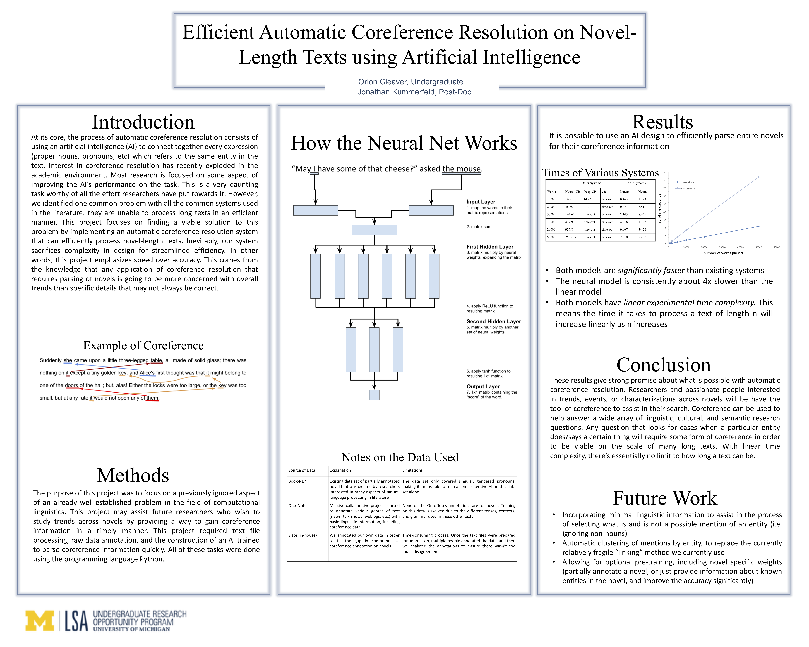

# Efficient Automatic Coreference Resolution

Fast-Coref is an effecient coreference resolution system implemented in Python using a simple linear model and DyNet for a neural model.  

###### About

Development of this project, mentored by Jonathan Kummerfeld, occured during the 2017-2018 school year under the Undergraduate Research Oportunity Program at the University of Michigan. 

## Abstract 

Coreference resolution is a well-studied problem in computational linguistics. The specific aspect of this problem we focused on in this project is efficiency. Many of the most accurate existing coreference tools (e.g. the StanfordNLP tool) are exceedly slow when used on novel-length texts. We developed an automatic coreference resolution system in Python using the DyNet library to help construct the neural network. Additionally, we annotated our own in-house data set, which we used to train the system. By strictly limiting the information our model could read to plain-text data and optimizing the neural net structure, we were able to develop a highly efficient system with minimal loss in accuracy. This project may assist future researchers who wish to study trends across novels by providing a way to gain precious coreference information in a timely manner. 

## Instructions 

#### Command line argments 

' --v           ' is verbose output  
' --linear    ' runs just the linear model (default is to run the neural model)  
'--all          ' runs both models (default is to run the neural model)  
'--cluster   ' runs neural model with some additional clustered features (sacrifice speed for accuracy in current implementation)  
'--s/--x/--o (required)' takes one argument, the file of annotatted data   
'--books     (required)' takes one argument, the file containing the paths to the book(s) that training/testing will occur on  
'--run          (optional)' takes one argument, a book that will be entirely parsed for coreference information after the training/testing  

#### Common usage on the command line: 

'example$ python dyref.py --v --all --cluster --s data/slate_data/alicesadventures.txt.annotation --books paths/alicePath.txt'
  
'example$ python dyref.py --s data/slate_data/alicesadventures.txt.annotation --books paths/alicePath.txt'

#### Format of files

All books can be in any text format, but some modification to readers.py may be required to get all types of books read in. (This includes the book file which is given to the optional ' --run ' argument) and used for running trained model 

##### Book path file (given to the required ' --books 'argument)
> book_id [tab] /path/of/file

##### example
> alice &nbsp;&nbsp;&nbsp;&nbsp; data/slate_data/alicesadventures.txt
> pride  &nbsp;&nbsp;&nbsp;&nbsp; data/slate_data/prideandprejudice.txt
> worlds &nbsp;&nbsp;&nbsp;&nbsp; data/slate_data/waroftheworlds.txt

##### Annotated data file, for training and testing
Data format given to the ' --s ' argument:
> (line_of_anaphor, col_of_anaphor) - (line_of_mention, col_of_mention)

Data format given to the ' --x ' argument:
> book_id [tab] anaphor_index [tab] mention_index

Data format given to the ' --o ' argument:
* Onto Notes utilizes in-text annotation *

## Results

It is possible to use an AI design to efficiently parse entire novels for their coreference information.

+ Both models are significantly faster than existing systems
+ The neural model is consistently about 4x slower than the linear model
+ Both models have linear experimental time complexity. This means the time it takes to process a text of length n will increase linearly as n increases

#### Conclusion

These results give strong promise about what is possible with automatic coreference resolution. Researchers and passionate people interested in trends, events, or characterizations across novels will be have the tool of coreference to assist in their search. Coreference can be used to help answer a wide array of linguistic, cultural, and semantic research questions. Any question that looks for cases when a particular entity does/says a certain thing will require some form of coreference in order to be viable on the scale of many long texts. With linear time complexity, there’s essentially no limit to how long a text can be.

#### Poster 

## Notes and Sources on Data

| Source of Data | Explanation | Limitations | Source |
|----------------|-------------|-------------|--------|
| Book-NLP Data-set| Existing data set of partially annotated novel that was created by researchers interested in many aspects of natural language processing in literature   | The data set only covered singular, gendered pronouns, making it impossible to train a comprehensive AI on this data set alone | Book-NLP, natural language processor designed for novels (https://github.com/dbamman/book-nlp) |
| OntoNotes Data-set     | Massive collaborative project  started to annotate various genres of text (news, talk shows, weblogs, etc.) with basic linguistic information, including coreference data | None of the OntoNotes annotations are for novels. Training on this data is skewed due to the different tenses, contexts, and grammar used in these other texts | Online database (https://catalog.ldc.upenn.edu/ldc2013t19) |
| In-house Data-set  | We annotated our own data in order to fill the gap in comprehensive coreference annotation on novels | Time-consuming process. Once the text files were prepared for annotation, multiple people annotated the data, and then we analyzed the annotations to ensure there wasn’t too much disagreement | Written ourselves, using an annotation tool designed by Jonathan Kummerfeld (https://github.com/jkkummerfeld/slate) |
| Literature | Set of all novels we used for training, testing, and running our code | -- | Project Gutenberg, an online database of free eBoooks (www.gutenberg.org) |

## TODO

+ Provide options for outputting the coreference information provided by process of running the model on an entire novel
+ Incorporating minimal linguistic information to assist in the process of selecting what is and is not a possible mention of an entity (i.e. ignoring non-nouns)
+ Automatic clustering of mentions by entity, to replace the currently relatively fragile “linking” method we currently use
+ Allowing for optional pre-training, including novel specific weights (partially annotate a novel, or just provide information about known entities in the novel, and improve the accuracy significantly)
+ Implemenent caching to minimize the recalculation of features
